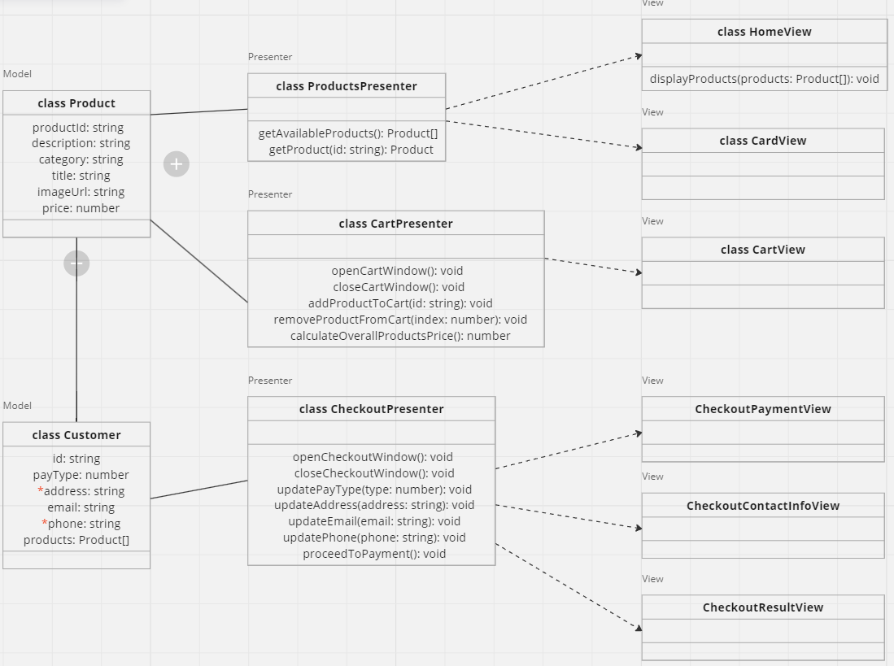

# Проектная работа "Веб-ларек"

Стек: HTML, SCSS, TS, Webpack

Структура проекта:
- src/ — исходные файлы проекта
- src/components/ — папка с JS компонентами
- src/components/base/ — папка с базовым кодом

Важные файлы:
- src/pages/index.html — HTML-файл главной страницы
- src/types/index.ts — файл с типами
- src/index.ts — точка входа приложения
- src/styles/styles.scss — корневой файл стилей
- src/utils/constants.ts — файл с константами
- src/utils/utils.ts — файл с утилитами

## Установка и запуск
Для установки и запуска проекта необходимо выполнить команды

```
npm install
npm run start
```

или

```
yarn
yarn start
```
## Сборка

```
npm run build
```

или

```
yarn build
```
## Архитектура приложения "Web-ларёк"

## Примененные паттерны

В проекте применен паттерн MVP (Model-View-Presenter), который обеспечивает четкое разделение ответственностей между компонентами приложения и улучшает его поддерживаемость и масштабируемость. Каждый компонент выполняет свою четко определенную роль:

- **Модель (Model)**: Отвечает за работу с данными приложения.
- **Представление (View)**: Отображает данные пользователю и взаимодействует с пользователем.
- **Представитель (Presenter)**: Связывает модель и представление, управляя взаимодействием между ними и логикой приложения.

### Компоненты модели данных

1. **Класс `Product`**
    - Отвечает за хранение информации о продукте.
   ##### Свойства:
    - `productId: string` - уникальный идентификатор товара.
    - `description: string` - описание товара.
    - `category: string` - категория товара.
    - `title: string` - название товара.
    - `imageUrl: string` - ссылка на изображение товара.
    - `price: number` - цена товара.

2. **Класс `Customer`**
    - Представляет данные о пользователе.
   ##### Свойства:
    - `id: string` - идентификатор пользователя.
    - `payType: number` - тип оплаты.
    - `address: string` - адрес доставки (*обязательное поле*).
    - `email: string` - email пользователя (*обязательное поле*).
    - `phone: string` - номер телефона пользователя (*обязательное поле*).

## Компоненты представителя

Представители (Presenter) связывают модель данных и представление, обеспечивая взаимодействие между ними и логику приложения.

1. **Класс `ProductsPresenter`**
   - Отвечает за управление данными товаров и их отображением.
   ##### Методы:
   - `getAvailableProducts()`: метод для получения доступных товаров.
   - `getProduct(id: string)`: метод для получения товара по его идентификатору.

2. **Класс `CartPresenter`**
   - Управляет отображением корзины и взаимодействием с ней.
   ##### Методы:
   - `openCartWindow()`: метод для открытия окна корзины.
   - `closeCartWindow()`: метод для закрытия окна корзины.
   - `addProductToCart(id: string)`: метод для добавления товара в корзину.
   - `removeProductFromCart(index: number)`: метод для удаления товара из корзины по его индексу.
   - `calculateOverallProductsPrice()`: метод для расчета общей стоимости товаров в корзине.

3. **Класс `CheckoutPresenter`**
   - Управляет процессом оформления заказа.
   ##### Методы:
   - `openCheckoutWindow()`: метод для открытия окна оформления заказа.
   - `closeCheckoutWindow()`: метод для закрытия окна оформления заказа.
   - `updatePayType(type: number)`: метод для обновления типа оплаты.
   - `updateAddress(address: string)`: метод для обновления адреса доставки.
   - `updateEmail(email: string)`: метод для обновления email пользователя.
   - `updatePhone(phone: string)`: метод для обновления номера телефона пользователя.
   - `proceedToPayment()`: метод для перехода к оплате.

## Компоненты представления

Представления отвечают за отображение данных и взаимодействие с пользователем.

1. **Класс `HomeView`**
   - Представляет главную страницу приложения.
   ##### Методы:
   - `displayProducts(products: Product[]): void`: метод отображает список товаров на главной странице.

2. **Класс `CardView`**
   - Отображает карточку товара.

3. **Класс `CartView`**
   - Отображает корзину.

4. **Класс `CheckoutPaymentView`**
   - Отображает форму оформления заказа, выбор способа оплаты и ввод адреса доставки.

5. **Класс `CheckoutContactInfoView`**
   - Второй шаг оформления заказа, пользователь вводит почту и номер телефона.

6. **Класс `CheckoutResultView`**
   - Третий шаг, результат выполнения.


